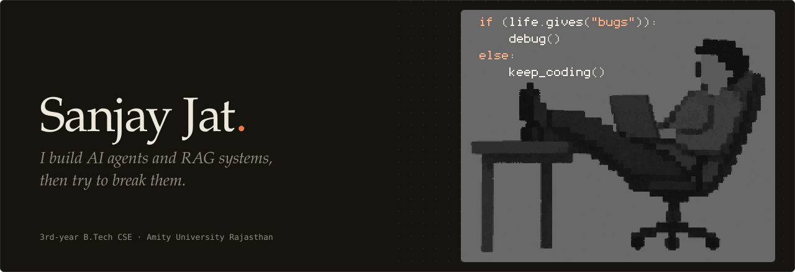

<picture>
  <source media="(prefers-color-scheme: dark)" srcset="assets/banner-dark.svg">
  <source media="(prefers-color-scheme: light)" srcset="assets/banner-light.svg">
  
</picture>
<p align="center">
  <b><a href="https://regulatory-intelligence-engine-two.vercel.app/">Try the Regulatory Intelligence Engine live</a></b>
  &nbsp;&nbsp;|&nbsp;&nbsp;
  <a href="https://github.com/Sanjay-jat/regulatory-intelligence-engine">Source</a>
  <br>
  <sub>The live demo asks for your own Gemini API key before it answers anything.</sub>
</p>
Hi, I'm Sanjay. I'm a third-year B.Tech CSE student at Amity University Rajasthan, and I spend most of my time building AI agents, RAG systems, and the backend plumbing that keeps them from falling over.
 
I like the unglamorous half of the problem: what the agent does when the search comes back empty, when a key is wrong, or when an action shouldn't happen without a human. That's usually where a demo turns into software.
 
## How I build
 
- **Agents get limits.** Retry caps, loop guards, a compliance check before anything executes, and a human approval step for the risky actions.
- **"I don't know" is a valid answer.** I would rather have a system say it found nothing than make something up confidently.
- **Failures should be loud.** Clear error messages, execution traces I can actually read, and, in other people's code, tool failures that are marked as failures.
- **Demos love the happy path.** I spend my time on the other paths.
## Featured projects
 
### Regulatory Intelligence Engine
 
Agentic RAG over SEBI and RBI circulars. These are long PDFs, some scanned, and old and new versions of the same rule sit online with nothing saying which one is current. You can ask in English or Hinglish, and it tells you which rule applies now and which one has been superseded.
 
```
route_intent → search_index → resolve_conflict → synthesize_answer → aggregate_output
```
 
- **One agent, on purpose.** Compliance answers should be predictable, so this is a single LangGraph agent rather than a multi-agent setup. Retries on empty results are capped, and permanent errors like a bad API key skip the retry entirely.
- **Current vs superseded.** Answers are labelled CURRENT or SUPERSEDED, with fuzzy matching to survive OCR drift. Checked on the SEBI KYC change from 30 days to 15 days, including a follow-up question.
- **Honest "not found".** Tested with an IRDAI query it had no documents for: it says so instead of guessing.
- **Full execution trace page**, so you can see every step the agent took.
- **Prompt-injection defenses** on all three LLM prompts.
- **Bring-your-own Gemini key in production.** After a key showed up in a LangSmith trace, I moved it out of the graph state into a ContextVar.
`FastAPI` `LangGraph` `FAISS` `Gemini` `Neon Postgres` `PyMuPDF + Tesseract` `React` `Docker`, backend on Render and frontend on Vercel.
 
[Live demo](https://regulatory-intelligence-engine-two.vercel.app/) | [Source](https://github.com/Sanjay-jat/regulatory-intelligence-engine)
 
### Recoverly
 
When a payment fails, retrying blindly is the wrong move, and so is messaging a customer at a bad hour. Recoverly is a LangGraph agent that decides what to do about a failed payment, and it has to get past a compliance check before it does anything.
 
```
detect_decline → decide_action → compliance_gate → execute → track_outcome
```
 
- **Silent retries only for recurring payments** (saved card, UPI autopay). One-time payments get a message, never a surprise charge.
- **Compliance gate.** Contact only within IST (8am-7pm), no retry on hard declines or without stored authorization, a retry cap, and opt-outs are honored.
- **Human approval for big retries.** Anything of ₹10,000 or more goes to an approval queue, with a recovery probability computed from batch history.
- **Live simulator and a replayable audit log** of every decision the agent made.
**Scope, plainly:** retries are simulated charges with idempotency keys, with no real payment gateway behind them. On a synthetic, seeded batch of 200 payments the agent recovered about 38%. That number comes from generated data, not real payments.
 
`FastAPI` `SQLAlchemy` `PostgreSQL` `React (Vite)` `Docker Compose`, Ollama locally and Gemini when deployed, frontend on Vercel and API on Render.
 
[Live demo](https://payment-recovery-agent-j8szwylvt-sanjay05.vercel.app/) | [Source](https://github.com/Sanjay-jat/payment-recovery-agent)
 
## Open source
 
5 merged contributions across 4 repositories: fixes and features in other people's agent and tooling projects, merged after maintainer review.
 
| Contribution | What I did |
| --- | --- |
| [amd/gaia#3740](https://github.com/amd/gaia/pull/3740) | Stopped agent turns from leaving Python files syntactically broken. `edit_file` now validates the result before writing or making a backup, and the turn tracks which files it changed. A maintainer later tightened the check during review. |
| [mikehasa/agentacct#238](https://github.com/mikehasa/agentacct/pull/238) | Fixed a stale Work pane in the TUI that kept showing old receipts after background polls. Added a regression test. Shipped in release 0.10.10. |
| [IndustriAgents/OPCUA-MCP#62](https://github.com/IndustriAgents/OPCUA-MCP/pull/62) | Failed Node tool calls now return the MCP `isError` flag, so clients can tell a failure from a result. Extended the failure-path tests to assert it. |
| [IndustriAgents/OPCUA-MCP#22](https://github.com/IndustriAgents/OPCUA-MCP/pull/22) | Added an aggregate (processed history) read tool to the Python server, with capability detection and validation against the aggregate functions the server advertises. The maintainer added the UTC fix and the end-to-end tests. |
| [sx4im/resultseal#10](https://github.com/sx4im/resultseal/pull/10) | Added a LangChain example that checks tool results before they reach the model, with a test proving empty results get blocked. |
 
## Stack
 
`Python` `C++`
 
**AI:** `Machine Learning` `Deep Learning (PyTorch)` `Generative AI` `Agentic AI` `RAG`
 
**Agent tooling:** `LangGraph` `LangChain` `MCP` `FAISS` `LangSmith` `Gemini` `Ollama`
 
**Backend:** `FastAPI` `SQLAlchemy` `PostgreSQL`
 
**Frontend and infra:** `React` `Docker` `Render` `Vercel`
 
## Contact
 
Happy to talk about agent reliability, RAG, or open-source work.
 
[LinkedIn](https://www.linkedin.com/in/sanjay-jat/) | [Email](mailto:sanjayjat354339@gmail.com) | [LeetCode](https://leetcode.com/u/sanjayjat05/)
