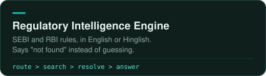
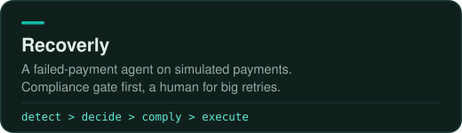

<picture>
  <source media="(prefers-color-scheme: dark)" srcset="assets/banner-dark.svg">
  <source media="(prefers-color-scheme: light)" srcset="assets/banner-light.svg">
  
</picture>

 

I build AI agents and RAG systems, then try to break them before anyone else does.

- B.Tech CSE at Amity University Rajasthan, 4th year
- Agents with limits: retry caps, compliance gates, humans for risky calls
- I'd rather a system say "not found" than guess

  &nbsp;
  &nbsp;
  &nbsp;
  &nbsp;
  &nbsp;
  &nbsp;
  &nbsp;
  

 

### Projects

&nbsp;
&nbsp;
Runs on your own Gemini key.

 

&nbsp;

 

  
  

### Open source

Contributed to&nbsp;
&nbsp;
&nbsp;
&nbsp;

5 merged PRs: reliability fixes, agent tooling, MCP tooling, and LangChain integrations.

### Say hi

Got a flaky agent? Send it over.

&nbsp;
&nbsp;

