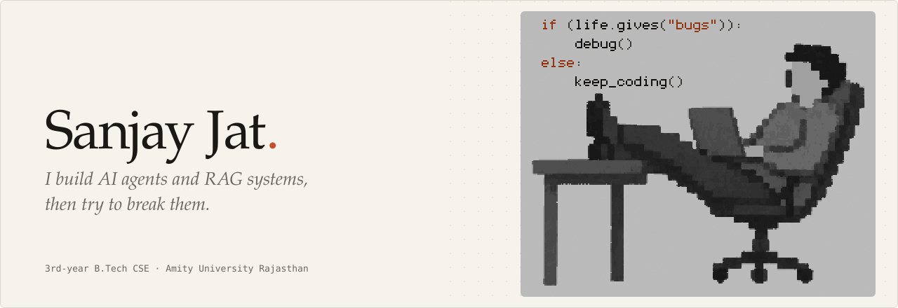
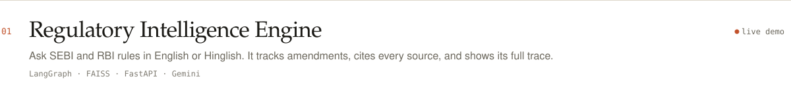
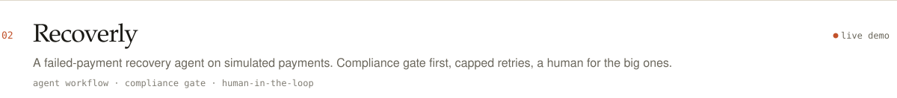

<picture>
  <source media="(prefers-color-scheme: dark)" srcset="assets/banner-dark.svg">
  <source media="(prefers-color-scheme: light)" srcset="assets/banner-light.svg">
  
</picture>

 

Hi, I'm Sanjay. I'm a 3rd-year CSE student at Amity University Rajasthan. I like building AI systems that do real work, and the backends that keep them honest.

### What I'm exploring

- **Agents with limits.** Retry caps, loop guards, compliance gates, and a human in the loop for risky calls.
- **Reliable tool use.** Making MCP and LangChain tools behave when an LLM is the one calling them.
- **Grounded answers.** Citations, source checks, and documents that replace each other over time.
- **Visible reasoning.** Full traces, so I can see why an agent did what it did.

### What I'm building

- FastAPI backends that carry state, retries and an audit trail.
- Agent workflows for finance and compliance, where mistakes cost money.
- Small, readable code I can explain line by line.

### Current focus

- Making agent and tool workflows dependable enough to leave running.
- Turning "it worked once" into something I can test and trace.

### Selected work

<a href="https://regulatory-intelligence-engine-two.vercel.app/">
<picture>
  <source media="(prefers-color-scheme: dark)" srcset="assets/work-rie-dark.svg">
  <source media="(prefers-color-scheme: light)" srcset="assets/work-rie-light.svg">
  
</picture>
</a>

[Live demo](https://regulatory-intelligence-engine-two.vercel.app/) &nbsp;·&nbsp; [Source](https://github.com/Sanjay-jat/regulatory-intelligence-engine) &nbsp;·&nbsp; runs on your own Gemini key

<a href="https://payment-recovery-agent-j8szwylvt-sanjay05.vercel.app/">
<picture>
  <source media="(prefers-color-scheme: dark)" srcset="assets/work-recoverly-dark.svg">
  <source media="(prefers-color-scheme: light)" srcset="assets/work-recoverly-light.svg">
  
</picture>
</a>

[Live demo](https://payment-recovery-agent-j8szwylvt-sanjay05.vercel.app/) &nbsp;·&nbsp; [Source](https://github.com/Sanjay-jat/payment-recovery-agent)

### How I think about agents

- Build it, then try to break it. Weak spots show up faster that way.
- An agent without limits is a liability. Cap it, gate it, and let a human decide the risky calls.
- If I can't trace it, I don't trust it.

### Stack I reach for

**Languages** &nbsp;`Python` `C++` 
**Backend** &nbsp;`FastAPI` 
**AI** &nbsp;`Machine Learning` `Deep Learning` `Generative AI` `Agentic AI` `RAG` 
**Tooling** &nbsp;`LangGraph` `LangChain` `FAISS`

### Open source

Contributed to [AMD GAIA](https://github.com/amd/gaia), [AgentAcct](https://github.com/mikehasa/agentacct), [OPCUA-MCP](https://github.com/IndustriAgents/OPCUA-MCP) and [ResultSeal](https://github.com/sx4im/resultseal).
Reliability fixes, agent tooling, MCP tooling and LangChain integrations.

 

  <picture>
    <source media="(prefers-color-scheme: dark)" srcset="https://github-readme-stats.vercel.app/api?username=Sanjay-jat&custom_title=GitHub%20activity&show_icons=true&hide_rank=true&card_width=400&border_radius=6&bg_color=15140f&border_color=2e2c24&title_color=ece8dd&text_color=938e7f&icon_color=e8794f">
    <source media="(prefers-color-scheme: light)" srcset="https://github-readme-stats.vercel.app/api?username=Sanjay-jat&custom_title=GitHub%20activity&show_icons=true&hide_rank=true&card_width=400&border_radius=6&bg_color=f6f3ec&border_color=ddd7c9&title_color=1a1915&text_color=6b675c&icon_color=c2522b">
    
  </picture>

<picture>
  <source media="(prefers-color-scheme: dark)" srcset="https://ghchart.rshah.org/e8794f/Sanjay-jat">
  <source media="(prefers-color-scheme: light)" srcset="https://ghchart.rshah.org/c2522b/Sanjay-jat">
  
</picture>

### Say hi

Got a flaky agent? Send it over.

[LinkedIn](https://www.linkedin.com/in/sanjay-jat/) &nbsp;·&nbsp; [Email](mailto:sanjayjat354339@gmail.com) &nbsp;·&nbsp; [LeetCode](https://leetcode.com/u/sanjayjat05/)
